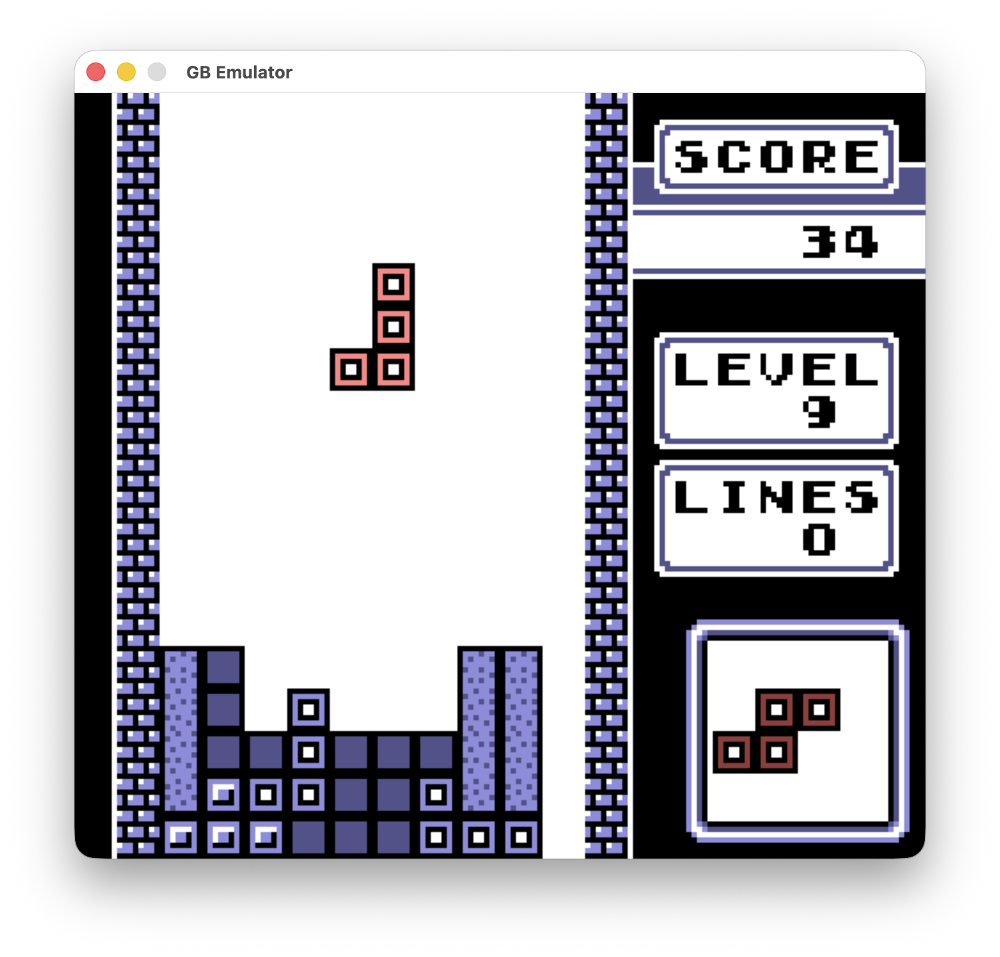

# GBemu

A gameboy emulator written in the Rust programming language.
It does not aim for perfect accuracy but can run most ROMs just fine.

It passes Blargg's `cpu_instr.gb` and `instr_timing.gb` test ROMs' tests.

Features:

- Save and resume emulator state
- Audio support (APU implementation)
- Mostly accurate rendering
- Color palettes for monochrome games
- MBC1, MBC2 and MBC3(with RTC) implementation (others to be implemented)

## Screenshots



## Keybindings

| Gameboy Key | Keyboard Key |
| ----------- | ------------ |
| START       | backspace    |
| SELECT      | return       |
| A           | Z            |
| B           | X            |
| UP          | W/↑          |
| DOWN        | S/↓          |
| LEFT        | A/←          |
| RIGHT       | D/→          |

| Function       | Keyboard Key |
| -------------- | ------------ |
| Change palette | space        |
| Exit emulator  | escape       |

## Building

It depends on [SDL3](https://wiki.libsdl.org/SDL3/FrontPage) for graphics and
sound, so install it first before building.  
SDL3 can be installed by following the instructions here
[SDL3 Installation](https://github.com/libsdl-org/SDL/blob/main/INSTALL.md).
Some platforms provide it via a package manager, I have listed a few common ones below:

- MacOS: `brew install sdl3`
- Fedora: `dnf install SDL3-devel`
- Ubuntu: `apt install libsdl3-dev`

After installing SDL3 build using cargo:

```bash
cargo build --release
```

## Usage

Use `gbemu --help` to show a list of commands and help text.  
Use `gbemu <command> --help` to show help related to a specific command.

Summary of available commands:

| Command       | Arguments                | Options                    |
| ------------- | ------------------------ | -------------------------- |
| `run`         | `<ROM_FILE>`             | `-s/--save-to <SAVE_FILE>` |
| `resume`      | `<SAVE_FILE>`            | `-s/--save-to <SAVE_FILE>` |
|               |                          | `-n/--no-save`             |
| `extract-rom` | `<SAVE_FILE> <ROM_FILE>` |                            |
|               |                          |                            |

### Examples

Run a ROM with save on exit:

```bash
gbemu run --save-to game.save game.gb
```

Resume a saved game, new state will be saved into the same file on exit:

```bash
gbemu resume game.save
```

Resume a saved game but save to a different file on exit, leaving the original save file intact:

```bash
gbemu resume --save-to another-game.save game.save
```

## TODOs

- Implement remaining MBCs
- Implement CGB mode
